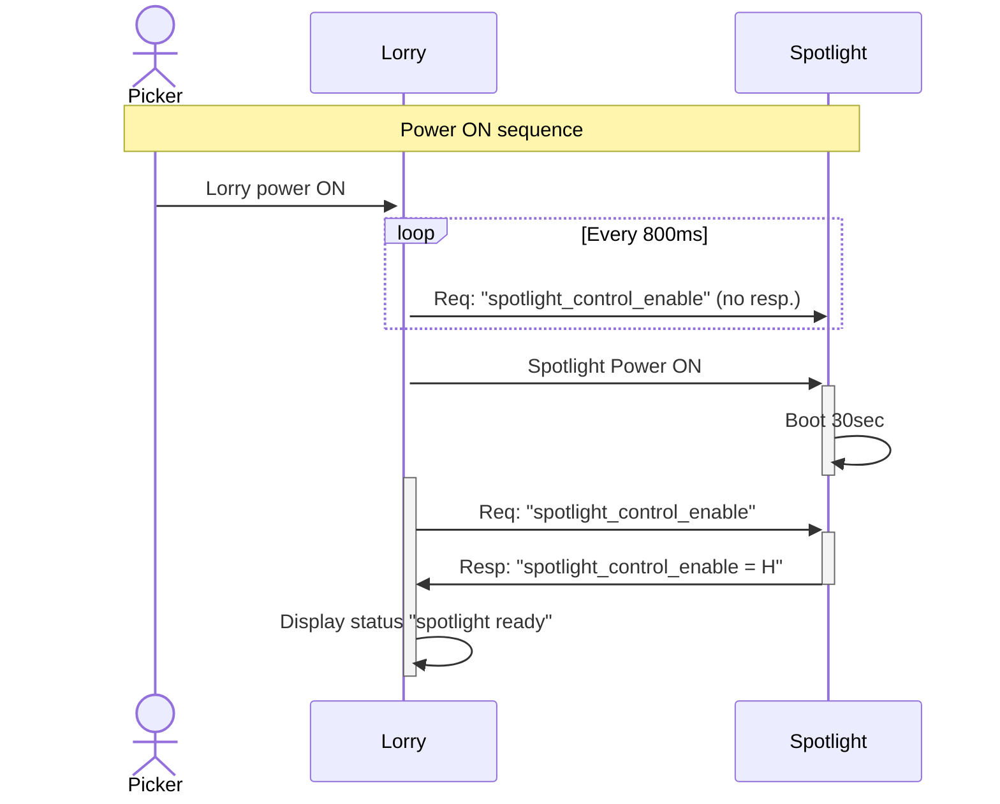
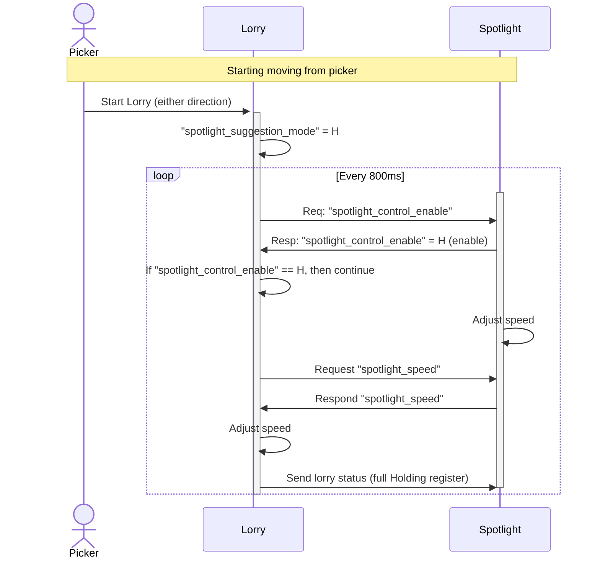
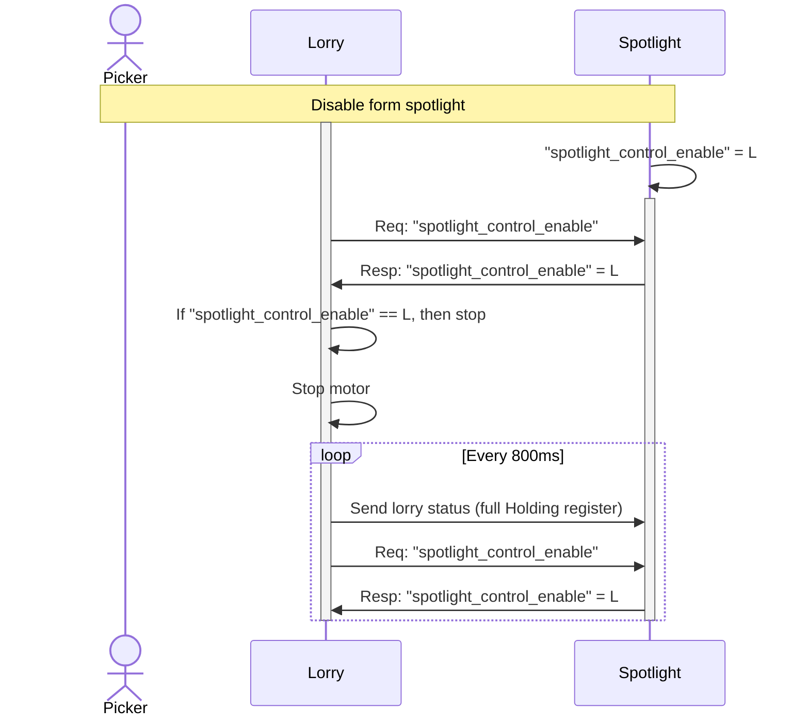
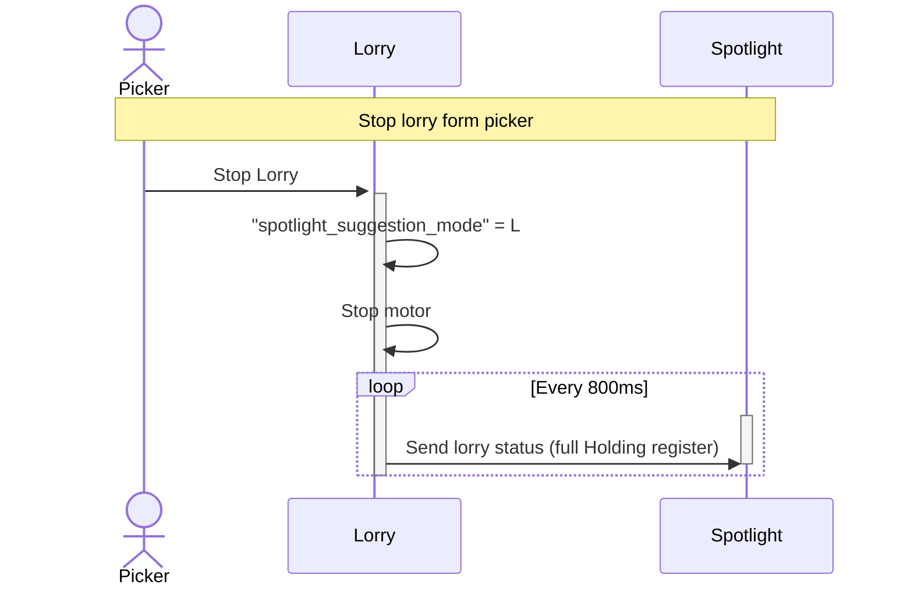
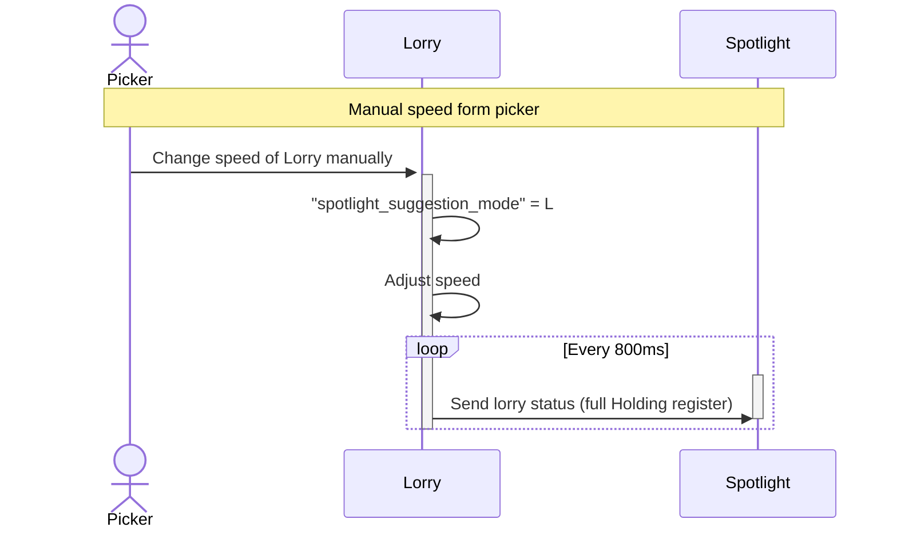

# modbus-lorry-spotlight-emulator

## Install the project

```bash
# If you use venv
python3 -m venv venv
source ./venv/bin/activate

# Install the package
pip install -U setuptools # only for python 3.10
pip install -e .
```

## Run the emulator

If you want to emulate the spotlight as device on the modbus. You can run the following script:

```bash
emulate_spotlight
```

## Power ON sequence


## Start moving from picker



## Disable spotlight speed from spotlight


## Stop lorry from picker


## Adjust lorry speed from picker
